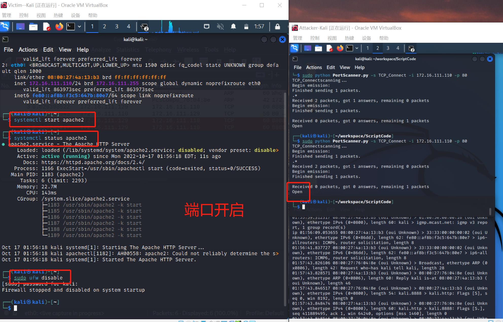

# 实验五————基于Scapy编写端口扫描器

-------------

## 实验目的

+ 掌握网络扫描之端口状态探测的基本原理

-------------

## 实验环境

+ python + scapy

-----------------

## 实验要求

+ 禁止探测互联网上的 IP ，严格遵守网络安全相关法律法规

+ 完成以下扫描技术的编程实现
    
    + TCP connect scan / TCP stealth scan
 
    + TCP Xmas scan / TCP fin scan / TCP null scan

    + UDP scan

+ 上述每种扫描技术的实现测试均需要测试端口状态为：开放、关闭 和 过滤 状态时的程序执行结果

+ 提供每一次扫描测试的抓包结果并分析与课本中的扫描方法原理是否相符？如果不同，试分析原因；

+ 在实验报告中详细说明实验网络环境拓扑、被测试 IP 的端口状态是如何模拟的

+ （可选）复刻 nmap 的上述扫描技术实现的命令行参数开关

-------

## 实验环境

+ VirtualBox虚拟机

+ python3 + scapy

+ nmap

+ wireshark

+ 网关(Gateway)：Gateway-Debian

+ 攻击者(Attacker)：Attacker-Kali

+ 靶机(Victim)：Victim-Kali

------

## 实验过程

### 1. 构建网络拓扑

本次实验采用`内部网络`的连接方式，以实现攻击者与目标主机在同一局域网的需求。各主机的网络配置与IP地址为：

|主机名称|网络配置|IP地址|
|---|----|---|
|Gateway-Debian|内部网络（intnet1/enp0s9）|172.16.111.1|
|Attacker-Kali|内部网络（intnet1/eth0）|172.16.111.129|
|Victim-Kali|内部网络（intnet1/eth0）|172.16.111.110|

### 2. 模拟端口状态的配置

**模拟端口状态**

|port status|service listening status|ufw status|
|---|---|---|
|open|active|disable|
|closed|inactive|disable|
|filtered|active|enable|

**端口监听服务**

+ TCP

    ```
    # 安装apache2服务
    # 监听80端口
    sudo apt update
    sudo apt install apache2
    ```

+ UDP
    ```
    # 安装dnsmasq服务
    # 监听53端口
    sudo apt -y install dnsmasq
    ```

+ 改变服务状态

    ```
    # 开启端口监听服务
    systemctl start [service]

    # 停止端口监听服务
    systemctl stop [service]

    # 查看服务状态
    systemctl status [service]
    ```

**使用防火墙ufw**

```
# 安装 ufw
sudo apt install ufw

# 开启 ufw
sudo ufw enable

# 关闭 ufw
sudo ufw disable

# 开启防火墙过滤规则
sudo ufw deny [port]/[tcp|udp]

# 关闭防火墙过滤规则
sudo ufw allow [port]/[tcp|udp]
```


### 实验脚本代码

[PortScanner.py](./PortScanner.py)

```
# 通过使用特定的命令行参数可以执行其对应的扫描方式
# 其参数使用方式可以查看帮助手册
sudo python PortScanner.py -h
```


### 实验结果

#### TCP Connect Scan

> 如果目标端口是开放的，那么在接到攻击主机发出的SYN请求之后，就会返回一个SYN+ACK回应，然后攻击主机端口再回应一个ACK;如果目标端口是关闭的，那么在收到攻击主机端口发出的SYN请求之后，就会返回一个RST回应;如果攻击主机端口没有收到任何的回应,也可以认为端口是关闭的，或者目标主机屏蔽掉对某些端口的SYN请求

+ **端口开启状态（open）**

    

    + **抓包情况**

    


+ **端口关闭状态（close）**

    

    + **抓包情况**

    


+ **端口过滤状态（filter）**

    

    + **抓包情况**

    


+ **nmap复刻**

```
sudo namp -sT -p 80 --reason 172.16.111.110
```


#### TCP Stealth Scan

> 如果目标端口是开放的，那么在接到攻击主机发出的SYN请求之后，就会返回一个SYN+ACK回应，然后攻击主机端口再回应一个RST;如果目标端口是关闭的，那么在收到攻击主机端口发出的SYN请求之后，就会返回一个RST+ACK回应;如果攻击主机端口没有收到任何的回应,可以认为是目标主机屏蔽掉对某些端口的SYN请求

+ **端口开启/关闭/过滤状态**


+ **各状态数据包分析**


+ **nmap复刻**

```
sudo namp -sS -p 80 --reason 172.16.111.110
```


#### TCP Xmas Scan

> 这种扫描方式很隐蔽，只有在目标端口处于关闭状态时，才会在收到攻击主机的FPU包时返回一个RST包，而其他状态则不予回复

+ **端口开启/关闭/过滤状态**


+ **各状态数据包分析**


+ **nmap复刻**

```
sudo namp -sX -p 80 --reason 172.16.111.110
```


#### TCP Fin Scan

> 这种扫描方式的隐蔽性比SYN扫描方式更高，因为攻击主机会通过发送FIN包来进行扫描，而FIN包可以通过只检测SYN包的过滤器。另外，该扫描方式下，目标端口只会在关闭状态下对攻击主机发送的FIN包回复一个RST包，其他状态下都不予回复。

+ **端口开启/关闭/过滤状态**


+ **各状态数据包分析**


+ **nmap复刻**

```
sudo namp -sF -p 80 --reason 172.16.111.110
```


#### TCP null Scan

> 在这种扫描方式下，所有攻击主机发送的TCP报文是没有头标记的。同xmas和fin一样，其目标端口也只会在关闭状态对攻击主机发送的包回复一个RST包，其他状态则不予回复。

+ **端口开启/关闭/过滤状态**


+ **各状态数据包分析**


+ **nmap复刻**

```
sudo namp -sT -p 80 --reason 172.16.111.110
```


#### UDP Scan

> 通过发送UDP包进行扫描，是一种开放式的扫描方式。当攻击者主机收到来自目标端口的UDP回复时，说明该端口为开启状态；否则说明该端口为关闭或过滤状态.

+ **端口开启/关闭/过滤状态**


+ **各状态数据包分析**


+ **nmap复刻**

```
sudo namp -sU -p 53 --reason 172.16.111.110
```


## 实验问题

无论是准备环节在scapy环境的测试，还是完成脚本后的调试环节，都会出现同一种扫描方式以及目标端口状态相同的情况下，所抓取的数据包并不完全一致的问题。然后，一些觉得会出现的情况与实际情况并不相符。比如，关于目标端口在过滤情况下会回复错误的ICMP数据包，但在实际实验中，只有UDP scan扫描出现了返回ICMP包的情况，其他扫描方式都没有出现过。这种想法与实际的差别让我对于脚本的编写产生很大的纠结，但最终决定还是保留猜想的情况。毕竟，一起皆有可能。


## 实验链接

[在线课本————黄玮](https://c4pr1c3.github.io/cuc-ns/chap0x05/exp.html)

[scapy](https://www.osgeo.cn/scapy/introduction.html)

[ufw下载](https://installati.one/kalilinux/ufw/)

[dnsmasq下载](https://installati.one/kalilinux/dnsmasq/)
