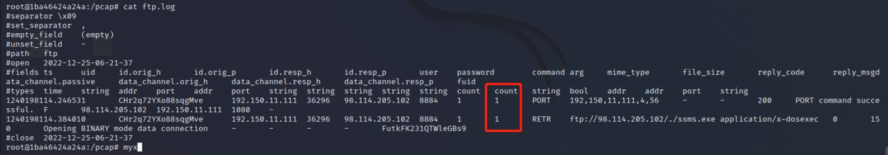

# 计算机取证

## 实验目的

- 了解计算机取证的基本原理和实现方法

## 实验要求

- [x] 使用 zeek 来完成取证分析

## 实验环境

+ Kali-demo：Kali Rolling (2022.3) x64

## 实验过程

### 使用 zeek 来完成取证分析

#### 安装zeek

+ 由于版本不兼容，再尝试下载zeek安装包无果后，我选择通过docker拉取镜像的方式下载zeek。根据[zeek-docker官方安装指南](https://docs.zeek.org/en/master/install.html)，安装最新版的docker镜像

```shell
# zeek最新版本
$ docker pull zeekurity/zeek:latest
```


```shell
# 检查docker镜像目录
$ docker images
```


```shell
# 安装并运行docker容器
$ docker run -itd zeekurity/zeek /bin/bash
# 检查刚创建的容器是否运行
$ docker ps
```


- 实验环境基本信息


+ zeek版本信息

```shell
# 进入容器
$ docker exec -it 1ba46424a24a /bin/bash  
# 在容器中查看zeek版本
root@1ba46424a24a: zeek -v
```


#### 编辑 zeek 配置文件

由于该容器内部没有vim编辑器，因此我采用在本地修改完配置文件后，复制到容器内部相应位置的方法

- 编辑 `local.zeek`文件，在文件尾部追加两行新配置代码

```bash
@load frameworks/files/extract-all-files
@load mytuning.zeek
```

+ 并在该文件所在目录下 ，执行以下命令，该命令结构是：`docker cp {文件名} {容器长ID}:{文件存放路径}`

```shell
$ docker cp local.zeek 1ba46424a24a4035709e49d47564fd25e1afcff993027ce81e2ab67a187710ed:/usr/local/zeek/share/zeek/site/
```

- 与local.zeek文件同理，创建 `mytuning.zeek`文件 ，在其内部添加以下内容

```bash
redef ignore_checksums = T;
```

+ 随后，在该文件所在目录下 ，执行

```shell
$ docker cp mytuning.zeek 1ba46424a24a4035709e49d47564fd25e1afcff993027ce81e2ab67a187710ed:/usr/local/zeek/share/zeek/site/
```

#### 使用 zeek 自动化分析 pcap 文件

+ 进入容器之前，将即将分析的pcap文件复制到容器内的`pcap`目录下：

```shell
docker cp  attack-trace.pcap 1ba46424a24a4035709e49d47564fd25e1afcff993027ce81e2ab67a187710ed:/pcap/
```

+ 进入容器之后，在pcap目录下，观察到即将分析的pcap文件的存在后，在该目录下，执行zeek分析命令：

```shell
$ zeek -r attack-trace.pcap /usr/local/zeek/share/zeek/site/local.zeek
```


+ 此时，在 `attack-trace.pcap` 文件所在的pcap目录下会生成一些 `.log` 文件和一个 `extract_files` extract_files目录下我们会发现有一个文件。


将该文件上传到 [virustotal](https://virustotal.com/) 我们会发现匹配了一个 [历史扫描报告](https://virustotal.com/en/file/b14ccb3786af7553f7c251623499a7fe67974dde69d3dffd65733871cddf6b6d/analysis/) ，该报告表明这是一个已知的后门程序！


根据这个发现就可以推测出入侵的存在，进而寻找入侵线索了。

通过阅读 `/usr/local/zeek/share/zeek/base/files/extract/main.zeek` 的源代码

```bash
function on_add(f: fa_file, args: Files::AnalyzerArgs)
        {
        if ( ! args?$extract_filename )
                args$extract_filename = cat("extract-", f$last_active, "-", f$source,
                                            "-", f$id);

        f$info$extracted = args$extract_filename;
        args$extract_filename = build_path_compressed(prefix, args$extract_filename);
        f$info$extracted_cutoff = F;
        mkdir(prefix);
        }
```

我们了解到该文件名的最右一个-右侧对应的字符串 `FHUsSu3rWdP07eRE4l` 是 `files.log` 中的文件唯一标识。

通过查看 `files.log` ，发现该文件提取自网络会话标识（ `zeek` 根据 IP 五元组计算出的一个会话唯一性散列值）为 `CVLa2U21NxgxpiUvo5` 的 FTP 会话。


该 `CVLa2U21NxgxpiUvo5` 会话标识在 `conn.log` 中可以找到对应的 IP 五元组信息。


通过 `conn.log` 的会话标识匹配，我们发现该PE文件来自于IPv4地址为：`98.114.205.102` 的主机。

#### Zeek 的一些其他技巧

- `ftp.log` 中默认不会显示捕获的 FTP 登录口令，我们可以通过在 `/usr/local/zeek/share/zeek/site/mytuning.zeek` 中增加以下变量重定义来实现：

```bash
redef FTP::default_capture_password = T;
```

在没有添加此行命令前，`ftp.log`的password列下的数据是被隐藏的，显示为`<hidden>`


在添加此行变量后，重新分析，就能得到password一列



+ 使用正确的分隔符进行过滤显示的重要性

```shell
# 从头开始查看日志文件，显示前1行
head -n1 conn.log

# Bro的日志文件默认使用的分隔符显示为ASCII码\x09，通过以下命令可以查看该ASCII码对应的“可打印字符”
echo -n -e '\x09' | hexdump -c

# 使用awk打印给定日志文件的第N列数据
awk -F '\t' '{print $3}' conn.log
```


- 查看Bro的超长行日志时的横向滚动技巧

```bash
less -S conn.log
```


- 使用 `zeek-cut` 更“优雅”的查看日志中关注的数据列

```bash
# 查看conn.log中所有可用的“列名”
grep ^#fields conn.log | tr '\t' '\n'
# 按照“列名”输出conn.log中我们关注的一些“列”
zeek-cut ts id.orig_h id.orig_p id.resp_h id_resp_p proto < conn.log
# 将UNIX时间戳格式转换成人类可读的时间（但该方法对于大日志文件处理性能非常低）
zeek-cut -d < conn.log
```


## 遇到的问题和解决方法

- 在容器内，有许多命令是无法使用，像vim、less、file等许多命令都无法使用。因此，当一个命令在容器中无法执行时，就需要把相应的文件复制到本地，再在本地执行相应的命令。比如说，在修改配置文件时，就是先在本地修改完相应的文件之后再将其复制到容器中相应路径。


## 参考资料

[第十二章课本实验](https://c4pr1c3.github.io/cuc-ns/chap0x12/exp.html)

[zeek官方链接](https://docs.zeek.org/en/master/install.html)

[docker命令指南](https://docs.docker.com/engine/reference/commandline/docker/)

[zeek官方docker hub](https://hub.docker.com/r/zeekurity/zeek)
